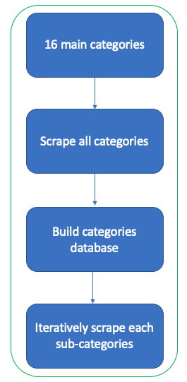

#### Coder School Project 1: Web scraping with Tiki
1. Khuong
2. Binh
3. Tran Vo

#### Technical Challenges:
- This website has some mechanism in place that makes it harder to scrape
  * we need to use headers
  * we need to re-try a few times (stop if failed more than 20 times) to successfully scrape a tiki product page (most challenging part)
  * some information is available as links to images: free gifts, tiki now etc... so have to compare variable with a url string instead of extracting the info directly
  
#### Coder School Project 2: Web scraping with Tiki for all categories
1. Khuong
2. Binh

#### Technical Challenges:

- This week's challenge involves a lot of time to scrape sub-categories and the product in each sub-categories
- However we can reuse the code from last week to do iterative update for each sub-categories
